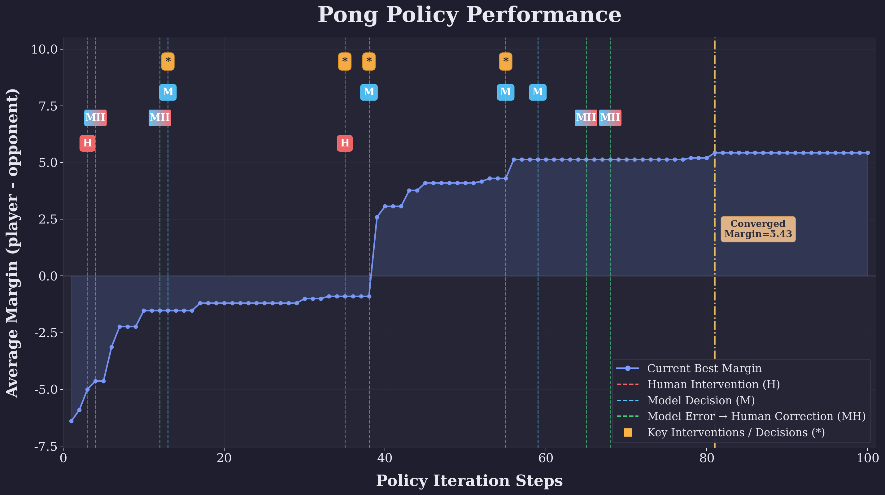

# 基于 Atari Pong 的启发式学习实验

[English](README.md) | 中文

本项目记录了一次基于 Atari Pong 的**启发式学习**策略优化实验，这一思想来自翁家翌的博客[《Learning Beyond Gradients》](https://trinkle23897.github.io/learning-beyond-gradients/)。
- 主要结果：使用 Codex 进行启发式优化 100 轮后，在在不同种子设定下的 30 局比赛中实现**全胜**，平均分差从 -6.40 提升至 5.43。

## 项目内容

- `pong_policy.py`：最终 Pong 启发式策略。
- `eval_pong.py`：批量运行策略评估，默认 30 局、11 分制，并生成 `eval_traces/`。
- `trace_pong_state_action.py`：输出单局逐 step 的 state、action 和得分 trace。
- `eval_policy_archive.py`：批量评估 `policy_archive/` 中的历史策略并写出 CSV。
- `plot_policy_archive.py`：根据归档评估结果生成性能曲线图。
- `policy_archive/`：优化过程中保存的历史策略版本。
- `original/`：初始策略和追踪脚本备份。
- `results/`：归档评估数据和性能图。
- `sessions/`：完整的 Codex 对话过程。

## 结果文档

- [POLICY.md](docs/POLICY_zh.md)：最终策略说明，文字化解析最终策略结构、可用 state、控制逻辑和固定评估结果。
- [REPORT.md](docs/REPORT_zh.md)：启发式学习过程报告，总结优化历史、人工/模型决策和实验启发。

## 优化过程

全程使用 Codex-v0.135.0 + GPT-5.5，优化 `pong_policy.py` 时遵守 [OPT.md](OPT.md) 中的流程。核心策略位于 `pong_policy.py`，并通过 `eval_pong.py` 在固定 seed 上批量评估。

- 修改前先运行评估并记录 baseline。
- 修改前将当前 `pong_policy.py` 保存到下一个 `policy_archive/NNN/`。
- `pong_policy.py` 只能包含单个顶层函数 `def policy(state): ...`。
- 只使用策略实际可见的 state 字段。
- 新策略必须在完整评估中提升 `average_margin` 才保留，否则从归档回滚。

过程记录在 `sessions/rollout.jsonl` 下，共优化 100 个策略版本，总优化时间约 5 小时。

优化过程性能曲线：



模型平均与对手的分差从 -6.40 提升到 5.43。比赛结果从 30 局 11 分制中仅胜 1 局，到所有局全胜。


## 快速开始

### 环境

项目环境配置：

```shell
pip install -r requirements.txt
```

### 标准评估

运行最终策略的评估：

```shell
python eval_pong.py --runs 30 --seed 0
```

评估会在 `eval_traces/` 下生成逐局 trace。

### 单局运行

无渲染运行策略：

```shell
python play_pong.py
```

生成单局 trace：

```shell
python trace_pong_state_action.py
```

### 策略归档评估

评估 `policy_archive/` 中的历史策略，并写出 CSV：

```shell
python eval_policy_archive.py --runs 30 --seed 0
```

根据 CSV 绘制性能图：

```shell
python plot_policy_archive.py
```

默认生成 `results/policy_archive_performance.png`


## 致谢

感谢翁家翌在[《Learning Beyond Gradients》](https://trinkle23897.github.io/learning-beyond-gradients/)中分享的启发式学习思路，为本项目提供了重要启发。
